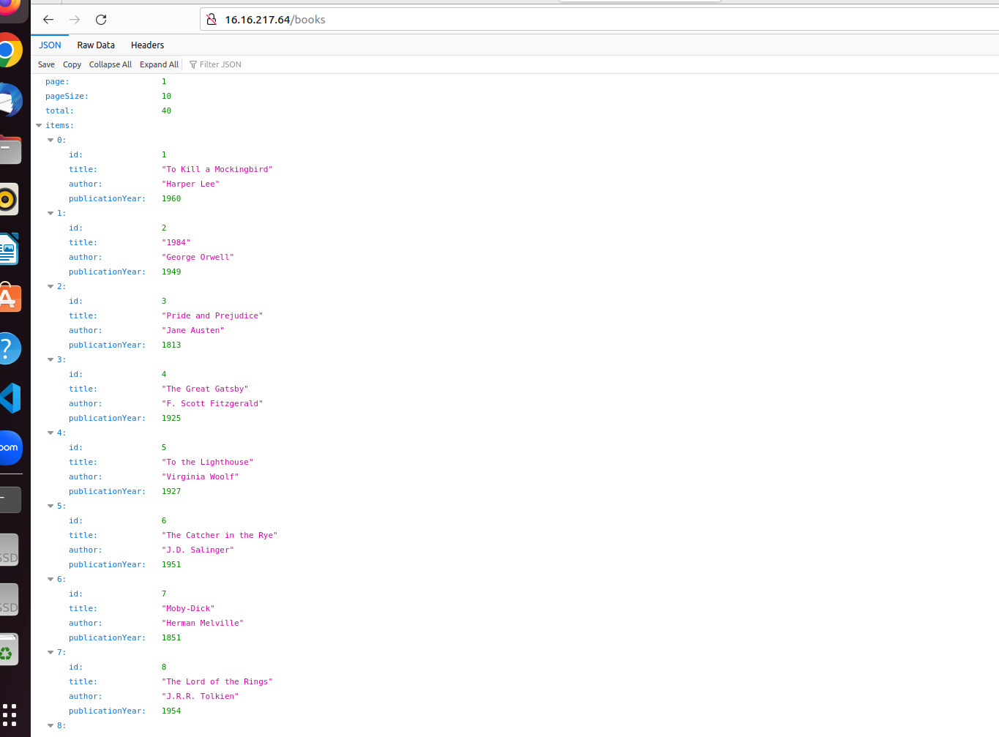

## AWS Project

1. First to deploy the book app to aws we have to create an instance
but i'm going to create a template first for that instance.

to create a template:
- name
- description
- image
- Instance type: s3.micro
- key pair
- security group
- shell script (user data)

2. The next step is to create an Application Load Balancer.
to create Application Load Balancer
- name
- area zoon
- security groups
- the we will create a target group:
    - we have to create a new instance with the same user data
    
- the create that load balancer

3. create an auto scaling group
- 

- ASG is now ready

- 

- on my local machine run: `sudo ssh -i ~/.ssh/shadi-key.pem ubuntu@13.53.184.141`

- to see what is happening: `tail -f /var/log/cloud-init-output.log`

now let's see the results:

